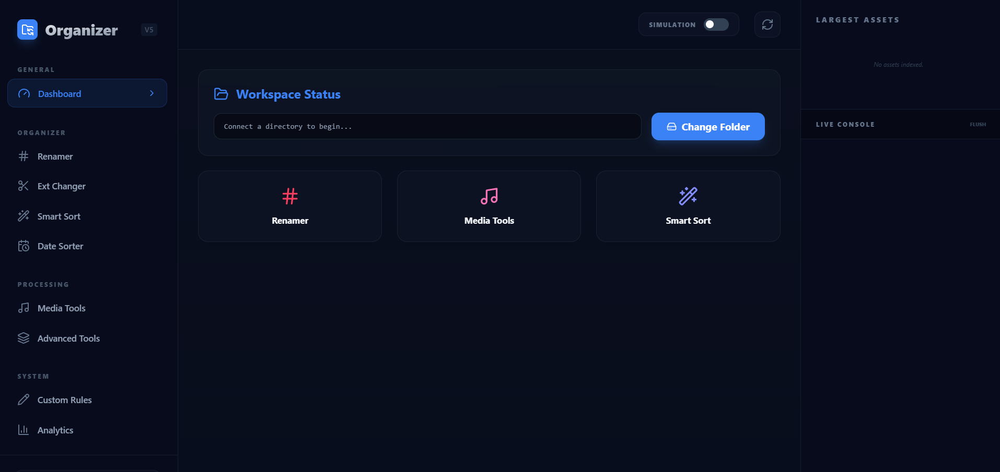
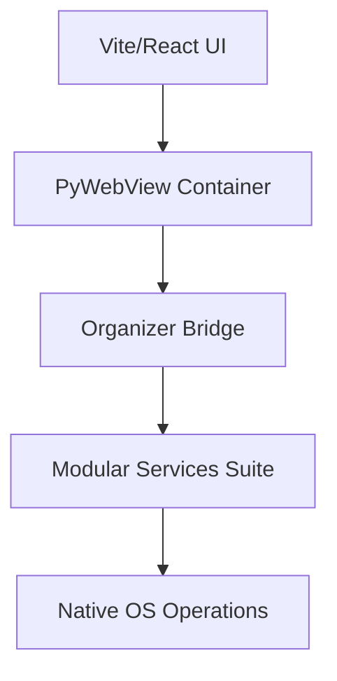

# 📁 Folders Organizer Pro v5.0.3


**Folders Organizer Pro** is a powerful Windows utility designed to transform digital chaos into a structured, predictable system. Unlike basic "cleaner" scripts, this tool treats your local filesystem with the respect it deserves—prioritizing safety, transparency, and user control.

It’s built for developers, photographers, and anyone who has ever stared at a `Downloads` folder and wanted to hit the reset button.

---

## 🎬 Before vs After

**The Mess:**
```text
Downloads/
  meeting_notes_v1.docx
  IMG_8829.jpg
  unzipped_project/ (nested folder)
  archive.zip
```

**The Masterpiece:**
```text
Downloads/
  Documents/ (categorized by type)
  Images/ (sorted and converted)
  Archives/
  Projects/ (deep-flattened into root)
```

## 🎬 How it Looks

### 🖥️ Professional Three-Column Dashboard
The central command center with sidebar navigation, real-time visual analytics, and a live console stream.


---

## ⚡ The Quick Start

```bash
git clone https://github.com/mosesrb/FoldersOrganizerPro.git
cd FoldersOrganizerPro
setup.bat  # Installs requirements and prepares the environment
Start Organizer.bat
```

---

## 🛠️ Performance & Reliability

We believe a system tool should be invisible and infallible.

### 🏗️ Modular Service-Based Architecture
The backend is powered by a decoupled Python services architecture, ensuring high performance even with millions of files:
- **`file_service.py`**: Handles low-level IO, content scanning, and recursive directory analysis.
- **`organizer_service.py`**: Manages the core logic for sorting, date-based organization, and deep flattening.
- **`duplicate_service.py`**: Implements the content-based hashing engine for accurate duplicate detection.
- **`automation_service.py`**: Houses the advanced suite (Cleanup, Archiving, Conversion, Extraction).

**The Tech Stack:**
- **Frontend**: Modern **Vite + React** UI for a fluid, responsive experience.
- **Backend**: Python 3.10+ utilizing **PyWebView** for native desktop integration.



### 🛡️ The "No-Regrets" Safety Net
Bulk file operations require absolute confidence.
- **Critical Shield (HARDENED)**: Comprehensive immunity for Windows system folders (`System32`, `Program Files`, etc.). Applied across the entire API surface to prevent any operation in sensitive areas.
- **Simulation Mode (Dry-Run)**: Every automation supports a safe simulation. Visualize changes in the dashboard before a single file is moved.
- **Live Console Engine**: A persistent log stream that tracks heavy operations in real-time, providing total transparency.
- **Atomic Undo**: Every session generates an encrypted `.organizer_history.json`. Revert any move, rename, or categorization with one click.
- **Recycle Bin Path**: Deleted duplicates are moved to the system Recycle Bin, not permanently erased.

### 🧠 Intelligent Hashing & Win32 Compatibility
- **Deterministic Hashing**: We use MD5 content analysis to find duplicates, even if they have different names.
- **Win32 Case-Neutral Engine**: Support for Windows-specific renames (e.g., lowercase to uppercase) that usually cause collisions.

---

## ✨ Feature Highlights

- **Smart Categorization**: One-click sorting into intelligent subdirectories (Code, Media, Docs, etc.).
- **Visual Analytics**: Real-time breakdown of workspace composition, largest assets, and file distribution charts.
- **Deep Flattening**: Recursively pull files from nested hierarchies while resolving name collisions.
- **Batch Automation Suite (RECURSIVE)**:
    - **Sequential & Regex Renaming**: Professional-grade bulk renaming.
    - **Media Processing Hub**: Recursive conversion (MP3 to WAV), PDF compression, and image optimization.
    - **Open in Explorer**: Direct integration for instant folder navigation from the dashboard.
    - **Archive Extraction**: Automated unpacking with source cleanup.
    - **Large File Archiver**: Intelligent compression for files over defined size thresholds.
    - **Additive Backups**: Smart sync engine that only copies new or modified files.
    - **Empty Folder Pruning**: Recursive cleanup of directory structures.

## 🛡️ Privacy & Security

- **100% Local**: No cloud processing. No data collection.
- **Direct FS Access**: No intermediate storage; the tool performs native OS operations for maximum speed.
- **Open Source**: Licensed under GPL-v3.

---

*Because a clean directory is a clean mind.*
